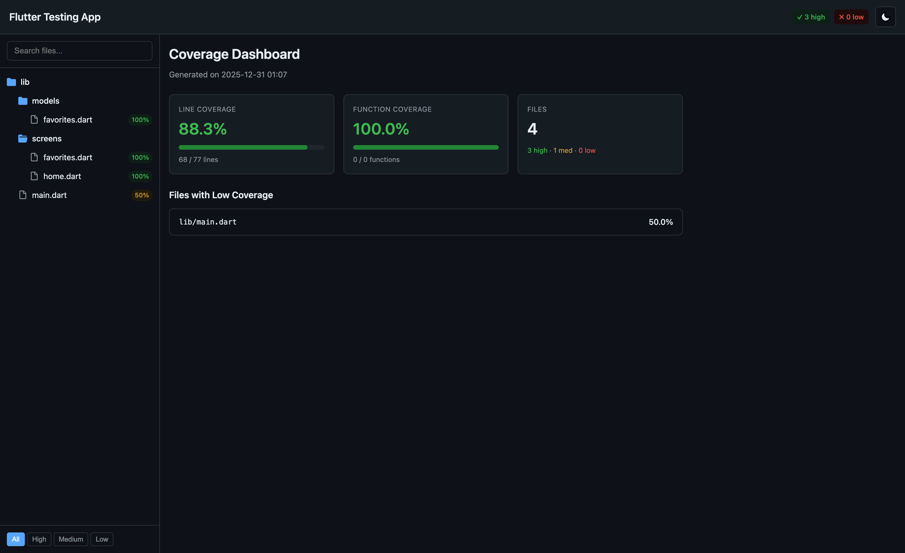
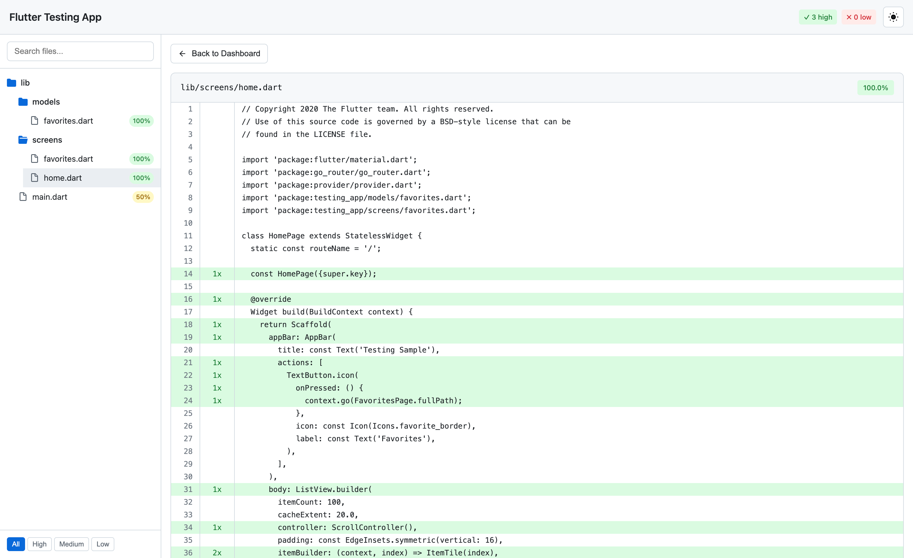
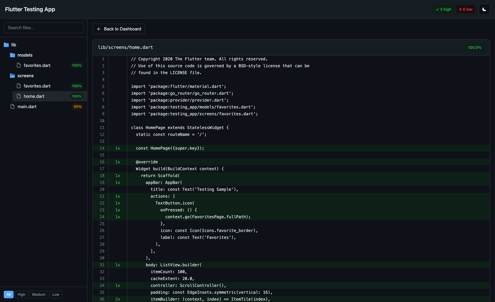

# Flutter Coverage Report

Generate **Playwright-style** HTML coverage reports from Flutter/Dart `lcov.info` files.

A modern, interactive coverage report with GitHub Primer design system - replacing the outdated `genhtml` output with a sleek, responsive UI.

## Screenshots

### Dashboard View

| Light Mode | Dark Mode |
|------------|-----------|
|  |  |

### Source Code View

| Light Mode | Dark Mode |
|------------|-----------|
|  |  |

## Features

- **Playwright-style UI** - Modern, interactive HTML report
- **GitHub Primer theme** - Light/Dark mode with system preference detection
- **File tree navigation** - Collapsible sidebar with folder structure
- **Search & filter** - Find files quickly, filter by coverage level
- **Source code view** - Inline code with line-by-line coverage highlighting
- **Dashboard** - Overall coverage stats, progress bars, top uncovered files
- **Single HTML file** - All CSS/JS inlined, no external dependencies
- **Responsive design** - Works on mobile, tablet, and desktop

## Installation

```bash
dart pub global activate flutter_coverage_report
```

## Usage

### Basic usage

```bash
# Generate coverage first
flutter test --coverage

# Generate HTML report
fcr coverage/lcov.info
```

### With options

```bash
fcr coverage/lcov.info \
  --output coverage/report.html \
  --title "My App Coverage" \
  --open
```

### All in one

```bash
flutter test --coverage && fcr coverage/lcov.info --open
```

## Options

| Option | Short | Description | Default |
|--------|-------|-------------|---------|
| `--output` | `-o` | Output HTML file path | `coverage/coverage-report.html` |
| `--title` | `-t` | Report title | `Coverage Report` |
| `--base-path` | `-b` | Base path for source files | Auto-detected |
| `--open` | | Open report in browser | `false` |
| `--help` | `-h` | Show help message | |
| `--version` | `-v` | Show version number | |

## Programmatic Usage

```dart
import 'dart:io';
import 'package:flutter_coverage_report/flutter_coverage_report.dart';

void main() async {
  // Parse lcov.info
  const parser = LcovParser(title: 'My Coverage Report');
  final data = await parser.parse('coverage/lcov.info');

  print('Coverage: ${data.lineCoveragePercent.toStringAsFixed(1)}%');

  // Generate HTML report
  const generator = HtmlGenerator();
  final html = await generator.generate(data);

  // Write to file
  await File('coverage/report.html').writeAsString(html);
}
```

## Report Features

### Dashboard
- Overall line and function coverage percentages
- Progress bars with color coding (green/yellow/red)
- File counts by coverage level
- Top 5 files with lowest coverage

### File Tree
- Hierarchical folder structure
- Coverage badge for each file
- Click to expand/collapse folders
- Click file to view source code

### Source Code View
- Line numbers
- Hit count for each line
- Green highlighting for covered lines
- Red highlighting for uncovered lines
- Back button to return to dashboard

### Filters
- Search by file name
- Filter by coverage level (All/High/Medium/Low)

### Theme
- Light mode (default)
- Dark mode
- System preference detection
- Manual toggle in header

## License

MIT
